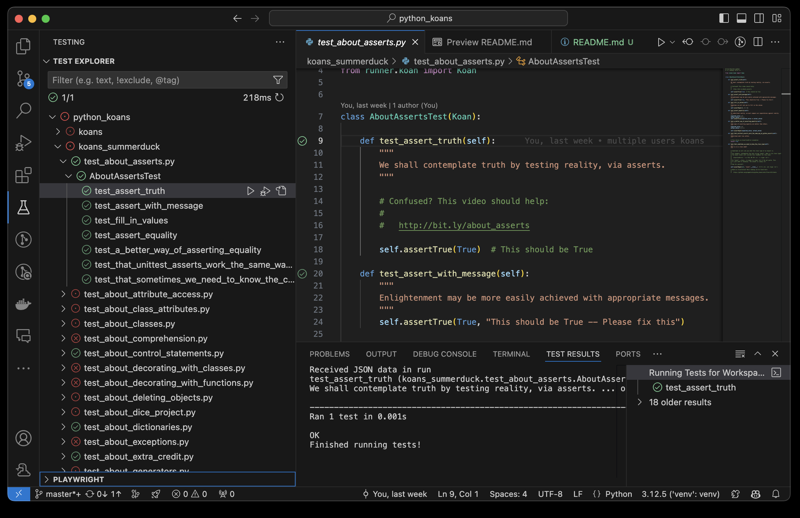

Python Koans
============
Python Koans is an interactive tutorial for learning the Python programming
language by making tests pass.


Python Koans is a port of Edgecase's "Ruby Koans" 
at http://rubykoans.com/.


Most tests are *fixed* by filling the missing parts of assert functions. Eg:

    self.assertEqual(__, 1+2)

which can be fixed by replacing the __ part with the appropriate code:

    self.assertEqual(3, 1+2)

Occasionally you will encounter some failing tests that are already filled out.
In these cases you will need to finish implementing some code to progress. For
example, there is an exercise for writing some code that will tell you if a
triangle is equilateral, isosceles or scalene.

As well as being a great way to learn some Python, it is also a good way to get
a taste of Test Driven Development (TDD).


Installing Python
-----------------

To use Python Koans, you need to install the Python interpreter. We currently support Python 3 and aim to stay updated with the latest production version. While newer Python versions should work fine, older versions may cause issues.

You can download Python from the official website: [Download Python](http://www.python.org/download)

After installing Python, ensure the folder containing the Python executable is in your system path. This allows you to run Python from a command console using `python3` or `python.exe` on Windows.

For additional help, visit: [Getting Started with Python](http://www.python.org/about/gettingstarted)


Installing Python Koans
-----------------------

To install Python Koans, follow these steps:

1. **Clone the repository**:
    ```sh
    git clone https://github.com/Summerduck/python_koans
    ```
2. **Create and activate virtual environment in this repo**:
    ```sh
    python -m venv venv
    source venv/bin/activate  # On Windows use `venv\Scripts\activate`
    ```
3. **Install python-dotenv**:
    ```sh
    pip install python-dotenv
    ```
4. **Create a `.env` file in the root of the repository** and add your username:
    ```sh
    echo 'USER="your_username"' > .env
    ```

5. **Make a copy of the `koans` directory and rename it to `koans_your_username`**
    ```sh
    cp -r koans koans_your_username
    ```
6. **Run the koans**:
    ```sh
    python3 contemplate_koans.py
    ```

This will start the interactive tutorial. Follow the instructions and modify the code to make the tests pass.


Run the tests by command line
---------------

Jake Hebbert has created a couple of screencasts available [here](http://www.youtube.com/watch?v=e2WXgXEjbHY&list=PL5Up_u-XkWgNcunP_UrTJG_3EXgbK2BQJ&index=1)

Or if you prefer to read:

From a \*nix terminal or windows command prompt run::

    python contemplate_koans.py

or

    python3 contemplate_koans.py


Apparently a test failed::

    AssertionError: False is not True

It also tells me exactly where the problem is, it's an assert on line 12
of .\\koans\\about_asserts.py. This one is easy, just change False to True to
make the test pass.
_____
Sooner or later you will likely encounter tests where you are not sure what the
expected value should be. For example::

    class Dog:
        pass

        class Dog: pass

    def test_objects_are_objects(self):
        fido = self.Dog()
        self.assertEqual(__, isinstance(fido, object))

This is where the [Python Interpreter](https://cs.stanford.edu/people/nick/py/python-interpreter.html#:~:text=In%20the%20terminal%20type%20the,on%20Windows%20ctrl%2Dz) can come in handy. In this case I can
fire up the command line, recreate the scenario and run queries:


The Python Command Line can be very useful for testing and debugging. You can recreate scenarios and run queries interactively.

To start the Python interpreter, open your terminal and type:
```sh
python3
```

For more detailed instructions, visit: [Python Interpreter](https://cs.stanford.edu/people/nick/py/python-interpreter.html#:~:text=In%20the%20terminal%20type%20the,on%20Windows%20ctrl%2Dz)

Run the tests continuously [Sniffer Support]
---------------

Sniffer allows you to run the tests continuously. If you modify any files files
in the koans directory, it will rerun the tests.

To set this up, you need to install sniffer::

    $ pip install sniffer

You should also run one of these libraries depending on your system. This will
automatically trigger sniffer when a file changes, otherwise sniffer will have
to poll to see if the files have changed.

On Linux::

    $ pip install pyinotify

On Windows::

    $ pip install pywin32

    Also available here:

    https://github.com/mhammond/pywin32/releases

On Mac OS X::

    $ pip install MacFSEvents

Once it is set up, you just run::

    $ sniffer

Just modify one of the koans files and you'll see that the tests are triggered automatically. Sniffer is controlled by `scent.py`

Run the tests from test explorer
-------------------------------
You can also run the tests using the Test Explorer in your IDE. This provides a more visual and interactive way to run and debug the tests.

1. **Open the project in your IDE**: Make sure your IDE supports Python and has a Test Explorer feature (e.g., Visual Studio Code with the Python extension).

2. **Locate the Test Explorer**: This is usually found in the sidebar or under the testing menu.

3. **Run the tests**: You should see a list of all the tests in the project. You can run them all at once or individually by selecting the appropriate options.

4. **Debug the tests**: If a test fails, you can use the debugging features of your IDE to step through the code and identify the issue.




Getting the Most From the Koans
-------------------------------

Quoting the Ruby Koans instructions::

	"In test-driven development the mantra has always been, red, green,
	refactor. Write a failing test and run it (red), make the test pass
	(green), then refactor it (that is look at the code and see if you
	can make it any better). In this case you will need to run the koan
	and see it fail (red), make the test pass (green), then take a
	moment and reflect upon the test to see what it is teaching you
	and improve the code to better communicate its intent (refactor)."


Content
-------

The Python Koans is a made up of about 2/3 Ruby Koans ported material and 1/3
Python specific tests. The content ported from Ruby Koans includes all the
assignment projects.

Content for Python 3 is a little different to the Python 2 flavor due to big
changes between the two different versions of the language.  For example, in
the Python 2 variant the differences between old and new style classes are
covered. This loses relevance in in the Python 3 version, but there are some
extra tests covering new functionality.


Finding More Koan Projects
--------------------------

There are number of other great Koan projects out there for various languages
and frameworks. Most of them can be found in github. Also there is a little
koans activity on bitbucket.

* Github koan projects:
    https://github.com/search?q=koans&ref=cmdform

* Bitbucket koan projects:
    https://bitbucket.org/repo/all?name=koans

Acknowledgments
---------------

Thanks go to Jim Weirich and Joe O'Brien for the original Ruby Koans that the
Python Koans is based on! Also the Ruby Koans in turn borrows from Metakoans
so thanks also go to Ara Howard for that!

Also thanks to everyone who has contributed to Python Koans! I got a great
headstart by taking over a code base initiated by the combined Mikes of
FPIP. So here's a little plug for their very cool Python podcast:

  http://frompythonimportpodcast.com/

A big thanks also to Mike Pirnat @pirnat and Kevin Chase @kjc have pitched in
as co-maintainers at various times
